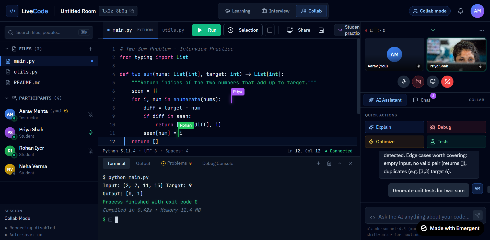

[🚀 Try LiveCode App](https://collab-editor-12.preview.emergentagent.com/)

This UI is mainly built using these things 👇✨

* **React / Next.js** → frontend framework
* **Tailwind CSS** → styling
* **Monaco Editor** → VS Code-like code editor
* **WebRTC / Liveblocks / Socket.io** → collaboration + live cursors
* **xterm.js** → terminal section
* **Framer Motion** → animations
* **Firebase / Supabase** → realtime users/chat
* **Video SDK / Agora / Stream** → video call panel
* **Lucide React / Heroicons** → icons

---

# Simple Basic Layout Code

This is the MAIN structure they use:

```jsx
<div className="flex h-screen bg-[#0b1020] text-white">

  {/* Left Sidebar */}
  <div className="w-64 bg-[#111827] p-4">
    Sidebar
  </div>

  {/* Main Editor */}
  <div className="flex-1 flex flex-col">

    {/* Navbar */}
    <div className="h-14 border-b border-gray-700 flex items-center px-4">
      Navbar
    </div>

    {/* Editor */}
    <div className="flex-1 bg-[#0f172a] p-4">
      Code Editor
    </div>

    {/* Terminal */}
    <div className="h-40 bg-black p-4">
      Terminal
    </div>
  </div>

  {/* Right Panel */}
  <div className="w-80 bg-[#111827] p-4">
    AI + Collaboration
  </div>

</div>
```

---

# Monaco Editor (VS Code Editor)

```bash
npm install @monaco-editor/react
```

```jsx
import Editor from "@monaco-editor/react";

<Editor
  height="90vh"
  theme="vs-dark"
  defaultLanguage="python"
  defaultValue="print('Hello')"
/>
```

---

# Terminal

```bash
npm install xterm
```

Used for:

* terminal output
* running code
* shell simulation

---

# Video Call

Usually:

```bash
npm install @stream-io/video-react-sdk
```

OR Agora SDK.

---

# Live Cursor Collaboration

Mostly:

* Socket.io
* Liveblocks
* Yjs
* Firebase realtime

That purple cursor names you saw = realtime cursor syncing.

---

